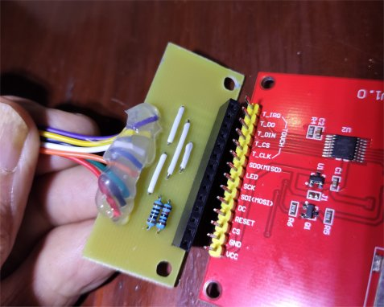

# The vMachine - Electronics

**[Home](readme.md)** --
**[History](history.md)** --
**[Hardware](hardware.md)** --
**Electronics** --
**[Software](software.md)** --
**[Installation](installation.md)**

This page has the schematic for the main vMachine **controller board**, as well
as the infrared **sensor board** and a small pcb used as the **lcd connector**.

The **controller board** has a number of features on it that you may or may not
want and that may be considered "optional" in the bigger scheme of things.

- eight pin display connector
- three pin ws2812b led strip connector
- power supply jack and step down buck convertor

even the SD card could be considered optional:

- six pin SD Card module connector

It is also possible, with a little effort, to create your own
circuit either on a breadboard, or a PCB and still take advantage
of this software using these schematics as guidelines rather than
verbatim.  In general the ESP32 pin assignments are somewhat flexible
and can be modified in the firmware and build process.

You may want to breadboard a vMachine incrementally, using a bench or
other power supply for the steppers and NOT getting 5V for the
ESP32 via buck down from the high power supply.  You may want
to utilize a different kind of sensor, or do something else with
the code and pins.

However, for the so inclined, included is the schematic, the kiCad
files behind the schematic as well as the flatcam and gcode files
needed to mill the PCB.  It would be a simple matter to produce a
pcb printed in China from a real board supply company, however, all
of my projects are essentially one-offs, so I am using the home-made
PCB approach.

## The Controller PCB

The controller board has the following connectors:

- a 38 pin slot for the **ESP32 Dev module**
- two 16 pin slots for **a498 Stepper Driver modules**
- a 6 pin connector for the **SDCard module**
- two 4 pin connectors for the **Stepper Motors**
- two 3 pin connectors for the **Infrared Sensors**
- a 3 pin connector for the **RC Servo**
- an 8 pin connector for the **TFT Touchscreen**
- a 3 pin connector for the ws2812b **LED Strip**
- a high power (12-24V) input jack
- a 2 pin **jumper for the 5V** from the buck step down convertor to the Esp32

Here is the schematic

You can ignore all the boxes labelled "v00" through "v100".
I did not know how to "untent vias" in kiCad when I made this and so
I put all my vias in the schematic as single pin connectors.

The kiCad footprints and milled circuit board make use of my own "footprints" so that
I could get a simple consistent large pad size for my initial attempts at learning
to mill PCB boards.

By far the hardest part of the production process was milling the green UV solder
resist epoxy off of the pads where I needed to solder.  Below is a picture of the circuit
board, still on the cnc machine, after removing the solder resist.

TODO: add hackaday blog/page(s) for
my spring loaded collet design and
my experiments with laser curing of UV photoresist and
link to them from here

**CAUTION:** after soldering the headers, connectors, and components
to this board
**BEFORE** inserting the ESP32 MODULE or connecting any other connectors,
please verify the circuit with a multi-meter for shorts and connections,
and then *PLUG IN THE POWER SUPPLY, TURN IT ON, and *ADJUST THE BUCK
CONVERTOR* TO PROVIDE 5V for the ESP32 5V PIN*.
Only after you have done the buck convertor voltage calibration
is it safe to plug in an ESP32 module and/or put the jumper on
the board which sends the 5V to the VIN pin of the ESP32.

These particular buck convertors come from the factory at
a "50% setting" meaning they will burn your ESP32 out if
you use a 20-24V power supply, by sending 10 or 12V to the
ESP32 which is only rated at 5V!!!

 

## The Infrared Sensor Board

This board runs on 3.3V and uses a pair of IR leds, one as an emitter and one
as a detector. The clear LED is the emitter.  I found that the black one worked well as
a detector. Both are generic 940nm leds that I bought in bulk (like 40 for $10)
some time ago.   The circuit uses uses a LM393 opamp as a comparator and
a variable 10K resistor to set the voltage level (light level) which will
trigger the sensor and there's a red LED on the top that lights up when the
sensor is triggered.

I believe this circuit is substantially the same as the robotic "infrared
obstacle avoidance modules" that sell on ebay for $1.50 or less like
the one below:

One can probably substitute that module verbatim, and some different 3D printing,
within this project to effect the same sensor without having to build a circuit board
and without changing any other software or circuits.  But I had the LEDs and I wanted
the orientation of them in a particular way over the belt and in a square, not a long
rectangular off centered box, over the stepper motors. Plus I'm having fun milling
PCB boards :-)

So I learned to use the LM393 (my first op-amp circuit) and designed and
implemented this board for the vMachine.

The milled PCB's came out pretty nice and it was easy to solder the parts to them:

They fit nicely into the 3D printed housings over the stepper motors,
and when adjusted they reliably detect the aluminum tape strip on the
vMachine belts.

Two of these boards are needed for the vMachine project.

 

## LCD Connector (board)

The **LCD Connector** cuts the number of pins from these generic SPI TFT touch
modules from 15 down to 8.   A number of the lines are duplicated for the
touch portion of the module (MOSI, MISO, and SCK) and others are merely held
high via resistors from the 5V VCC line.

The images below are of a previous (but exactly the same electronically) version
of the PCB that was larger and had mounting holes.  There are no mounting holes
for the LCD connector anymore.  It fits snugly enough without being screwed on.

After populating the board, I just re-arrange the pins slightly and
solder a pre-wired JST 8 pin header to the board and, after testing,
slap some hot glue on the wires  for stress release.  The other end
of the wires has a female 8 pin JST connector that plugs into the 8 pin
connector on the controller board.

 

<a href='software.md'>NEXT</a><i> - Software Architecture and Configuration ...</i>

