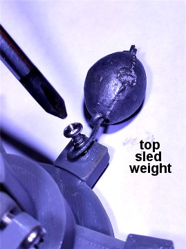
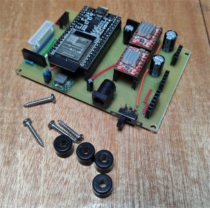

# The vMachine - Hardware

**[Home](readme.md)** --
**[History](history.md)** --
**Hardware** --
**[Electronics](electronics.md)** --
**[Installation](installation.md)**

## Parts List

The following parts are needed and/or optional to construct the vMachine.

- the **board**
- two **nema 17 stepper motors**
- two one meter 4 wire **cables** with connectors for the stepper motors
- two 16 tooth 5mm GT2 **pullies** for the stepper motors
- two meters of 5mm GT2 **belt**
- one MG90 **RC Servo**
- one meter 3 wire **cable** with connectors for the servo
- two **infrared sensor boards** (from the [Electronics](electronics.md) page)
- two one meter 3 wire **cables** with connectors for the infrared sensors
- one **vMachine control board** (from the [Electronics](electronics.md) page)
- (optional but highly recommended) *SD Card Module*  for the vMachine board
- (optional) three *WS2812b LEDs* cut from a led strip with 3 wire cable and connector soldered on
- (optional) 3.2" 320x240 SPI TFT *Touch Screen* with the **lcd connector and cable** from the [Electronics](electronics.md) page
- two dabs of white acrylic paint, or two small pieces of white electrical or aluminum duct tape
- a variety of **lead fishing weights**

as well as the **3D printed parts** shown on this page, along with a variety
of M2 and M3 (2 and 3 mm) **machine and wood/metal screws**.


## 1. The Board

The board is 28.75" wide by 24" high from 1/2" or 3/8" plywood.


[](images/hardware_the_board.jpg)


I cut some hand-holds into mine and finished it with clear polyurathane.

I drilled the holes for the screws and wires after preparing the board.

<br>

## 2. Motor Mount and Infrared Sensor Assembly

I generally print everything from PLA with 0.3mm layer heights in draft quality for speed,
unless otherwise noted.  The first files printed from the **stl directory** are the
**motor_mount_left** and **motor_mount_right**.

[](images/3D_motor_mounts.jpg)

I print these "face down" with no supports.

Then *two sets* of the **sensor_housing** and **sensor_top** are printed in the orientation
shown below so they also need no supports.

[](images/3D_infrared_housing.jpg)

Assembly then proceeds as follows.

The pulley is attached to the Nema17 motor with two included set screws and the motor is
attached to the motor mount with four M3x6 machine screws.  The combination is then attached
to the wooden board with two M3x12 self threading (wood/metal) screws into small (1/16") holes
drilled into the board using the motor mount as a template.

[](images/motor_mount_assembly.jpg)

The infrared sensor housing is attached to the motor mount from the rear by two M3x6 machine
screws directly into the plastic, then the
sensor circuit board is placed inside and the sensor body top is snapped into place and/or
secured with an M2x10 machine screw from the top directly into the plastic.

The process is repeated for the other side of the board.

<br>

## 3. 3D Print Sled Parts

The sled consists of several parts

- the **sled_base**
- the **sled cap**
- the **left and right bearings**
- the **pen_shaft** and **pen_tip**
- and the **servo arm**

The sled parts are all printed without supports.

[](images/3d_sled_base.jpg)
[](images/3d_sled_cap.jpg)
[](images/3d_sled_bearings.jpg)

The **sled_cap** screws onto the sled_base, allowing a little room for the sled bearings to
move while holding the RC Servo in a more-or-less vertical orientation.

Note that the left **sled_bearing** is taller than the right **sled_bearing** and goes on the bottom.
I sanded the bearing faces to make them as smooth as possible.  Later we will put a little
grease or other lubricant on them as it is important that they rotate about the sled_base
as freely as possible once the sled cap is screwed on.

[](images/3D_sled_pen_shaft_and_tip.jpg)
[](images/3d_sled_servo_arm.jpg)

The **pen_shaft** is printed vertically with the *top down* (upside down).  I printed the
pen_shaft, pen_tip, and servo arm with 0.20mm layer heights in a quality setting on my Prusa.
Before assembling I also put the pen shaft in a drill and turned it while sanding as best I
could to make it as smooth as possible. I also sanded the inside of the pen cap a bit.
It is important that the pen_shaft move freely in the pen-cap.

The **pen_tip** is printed (without supports, but with a **4 or 5mm "brim"** for stability.
It is printed vertically with the *top up*.  The shaft and tip are designed to accomodate a
**0.5mm Sharpie** felt pen.  While testing, the **pen_tip** part can be moved
up and down inside the pen shaft until you get it so that the tip of the felt pen just barely
touches the board (and lifts the whole assembly up off of the board about 1/2mm) when the
servo arm is "down".


The pen shaft is designed so that when the **servo_arm** is down, it automatically centers itself
in the pen base (due to the bevelled angles).  The adjustable pen_tip allows you to adjust the actual
contact of the pen with the paper while the shaft is fully down.  The tip of the Sharpie felt pen
should extend past the base about 1/2 mm when the servo arm is completely down, and it should not move around from
that position.

<br>

## 4. Sled Assembly

The parts for the sled should be printed and dry-fitted to make sure the bearings move smoothly
around the base and that the pen_shaft travels smoothly up and down in the sled when assembled.

The pen_shaft was designed with tight tolerances, with the specific idea that the shaft
and inside of the sled_cap would be sanded smooth after printing, so they may not slide
freely immediately after printing.  It is difficult to sand the inside of the sled_cap/base,
and care should be taken when sanding the pen_shaft itself so as not to introduce wobble
or too much loosensess.  One way or the other it is key that the pen shaft move smoothly
up and down and that the bearings are free to rotate.  So you must sand things and/or
even reslice and reprint them as necessary until you get a good working set of sled parts.

A dry or wet lubricant may be helpful.  I used a little silicon grease but I think it
is a bit heavy.  Some light lubricating oil or a dry graphite lubricant might
work better.

Once the sled parts have been printed and dry fitted and you are satisified with them,
assembly of the sled may proceed.


### 4a. Attach Belts to the Bearings

Attach one meter of GT2 5mm belt to each of the two bearings as shown
with one M3x6 machine screw threaded into the plastic.

[](images/attach_belts.jpg)


### 4b. Measure and Place the Zero Marks on the Belts

I initially started by *painting* a white stripe on the black GT2 belt with
acrylic paint.  That worked ok, but it turned out to be easier to just cut
a small piece of white electrical tape and stick it on the belt.  Then, in
the end, I found that I got a better "signal" for the infrared sensors if,
instead of white paint or tape, I put a small piece of **reflective aluminum
tape** on the belt.

[](images/aluminum_on_belt.jpg)

The aluminum duct tape is fairly available and inexpensive and comes in
2" wide rolls and is useful for other things, and we only need two small
5x5mm squares of it, so I recommend using it if you have it, but white
paint, fingernail polish, or white electrical tape can be substituted as
needed.

In any case, we need to make a 5mm wide stripe of some kind on the belt
starting at 200mm from the center of the sled.  So we will paint the area
on the belt that will be from 200mm to 205mm from the center of the sled.

[](images/mark_belt.jpg)

The *edge of the belt attachment is exactly 40 mm* from the center of the sled.
So we need to make the zero marks an additional **160mm** along the belt from there,
so that it will end up at 200mm from the center of the sled.

Place a ruler against the edge of the belt attachment and measure **160 mm** along
the belt. That will be the "leading edge" of the zero mark.  Place the aluminum
or electical tape, or paint the line, starting there and proceeding away from
the sled for 5 mm.

Another reason I prefer the tape approach to the paint approach is that you
can replace it or move it as necessary.  The paint tends to peel off in time,
as does the tape, so they will likely need to be refreshed over the lifetime
of the machine.  The tape is easier to use and easier to replace.


### 4c. Assemble the Sled Base

Place the left bearing on the sled_base, then place the right bearing on
top of it, and screw the sled_cap on snugly (but not overly tight).  It
should be the case that the bearings still turn freely when the cap is snug.

It should also be the case that when the cap is snug and the bearings are
in their proper positions that the servo will be oriented downward, along
with the two weight attachment points, and the single centered weight attachment
point will be pointed upwards.


[](images/proper_orientation.jpg)


### 4d. Attach and Test the Servo

The servo is a tight fit.  Cram it in there.  It barely needs a screw,
but I used one M3x6 screw, threaded directly into the plastic of the
sled_cap to secure it.

(This section assumes that you have already installed the needed software,
and built and uploaded the firmware to the ESP32.  Please see the
**[Installation](installation.md)**
page for more details.

Before attaching the stepper motors or high-voltage (19.5V) power supply,
we want to run the ESP32 on USB power and verify the functionality and
positioning of the RC Servo.

Attach the servo to the circuit board with its cable and boot the ESP32
up with a serial monitor connection by plugging the USB cable into your
computer.  You can use the Serial Monitor in the Arduino IDE to access
the ESP32 firmware.

In the default machine coordinate system, the servo moves between 0 and -90
(minus ninety) degrees (clockwise from the top of the servo), where -90 degrees
(clockwise) is in contact with the paper.
At that  point the servo arm will be slighly below parallel to the paper,
and the pen_shaft will be more or less "locked" in a full down position.
We call this the **pen down** position.


[](images/pen_down_position.jpg)

If we back the servo off about 20 degrees, to -70 degrees (minus seventy)
it will turn counter clockwise and lift the pen off the paper cleanly.
We call this the **pen up** position.

[](images/pen_up_position.jpg)

However, until we hook the servo up to the circuit board the first time, there
is no way to tell what position the servo is in. So, before even attaching the servo
arm, make sure the servo moves as expected by entering the following GCODE commands
into the monitor terminal.

```
G0 Z-90
```

is the command to send the servo to the "pen down" position and

```
G0 Z-70
```

is the command to send the servo to the "pen up" position.  As you type these
into the serial monitor and press the **Send** button
the servo should move and the firmware should respond
each time with "ok" as in the below photo of the Arduino Srial Monitor.


By entering these commands alternatively, one after the other, you should see the servo move
predictably clockwise or counterclockwise 20 degrees.  You can try other values
too.  In general just *play* with the servo using the serial monitor until you
are confident you can control it.

Once you can control it, you can go to the "pen up" position with "G0 Z-70"
and attach the servo arm with it's screws.  The servo arm should be just slightly above
parallel to the sled_base bottom at that point as in the below photo:

[](images/servo_up_position.jpg)

Then the "pen down" command (G0 Z-90) can be issued and the servo arm should
move to the following approximate position:


[](images/servo_down_position.jpg)

**REPEAT and TEST** the servo position until you are satisfied.  You can then
turn the machine off (unplug the USB cable) and the servo will move freely.
Turn the servo arm counter-clockwise till it points straight up, and **insert
the pen_shaft** into the assembly **while turning the servo arm clockwise**,
engaging it with the servo arm as you go.
You should find that you can easily remove and insert the pen_shaft by
manually moving the servo arm at the same time you turn the pen_shaft
as you insert or remove it.


When sent to the "pen down" position the servo should snap the pen_shaft to the down position
and lock it in place, but not have so much force that it is stressing the servo or plastic.
If turns too much, or too little, remove the servo arm and turn it one notch in the needed
direction, and re-attach it, and re-test.

Continue playing with these GCODE commands and the servo motor on your desk
until the servo reliably moves between the pen-up and pen-down positions
with the minus-70 and minus-90 gcode commands.


### 4e. Insert the **pen_tip** part and a Sharpie for calibration

It's easier to play with this part on your desk than on the machine, so
let's setup the Sharpie pen position before mounting more stuff.

The **pen_tip** part is inserted into the end of the pen_shaft.  You should find
that it is a snug fit as-is from the 3D printing.
With the **pen_tip** part inserted into the **pen_shaft** you
should be able to insert a **Sharpie** into the assembly such that the tip of the
Sharpie just protrudes past the end of the pen_shaft by a mm or two as in
the below photo.

[](images/pen_tip.jpg)

You can adjust the position of the **pen_tip** part by moving it in or
out of the **pen_shaft** as needed.   When everything is correctly positioned
and the pen_shaft is inserted in the ***sled_base***, and the servo is in the
"pen down" position, the tip of the Sharpie should protrude just past the
bottom of the sled_base by approximately 1/2 mm.

[](images/sled_bottom.jpg)
[](images/pen_tip_detail.jpg)


**DONT GLUE IT YET!!**   Later when the entire machine is working,
you can remove the Sharpie and the pen_shaft add a tiny drop of super glue to the
pen_tip part to secure it within the pen_shaft.   For now however, remove the
Sharpie and proceed to the next step (attaching the weights).


<br>

## 5. Attach the Weights

OK, I have put off talking about the lead weights as long as possible.

Your mileage may vary, and some experimentation may (will) be necessary.

On my machine I have the following lead fishing weights attached:

- 5 ounces (a little over 1/4 lb, or about 140 grams) at the end of each belt
- 1 ounce on a piece of wire off the top of the sled
- 2 ounces on the right lower side of the sled.

[](images/belt_weights.jpg)

Attach the belt weights however you like.  I threaded the belt through
a ring on the 3 oz weight and through a washer so that it is adjustable.
Then I hung the two one ounce weights on a piece of wire from that.

The lead weights serve two main purposes.   First of all the weight of the
sled and the weights at the ends of the belt keep the belt engaged with
the motor pullies.  Without any weights the belt would slip and be useless.

In addition, the weights on the sled were carefully chosen, and placed, through
much experimentation, such that when the pen is "down" the ENTIRE SLED IS LIFTED
OFF OF THE BOARD and the only part of the sled contacting the board (the paper)
is the tip of the pen.

[](images/top_weight.jpg)
[](images/right_weight.jpg)

The weights on the sled are attached with M3x5 wood/metal screws.  **It is important
that the heads of the screws do not protrude past the bottoms of the holes!!**.
The right-bottom weight is attached directly with a screw.  The top weight
is fitted on a piece of steel wire with a loop bent in it for the screew.

It's a balancing act.  We are also trying to keep the rotational orientation of the sled
more or less fixed, so the heavier weight at the bottom serves that purpose: to
keep the servo pointed downwards.

A slight weight is needed above the sled to allow it to balance on
the pen tip.  When weighted correctly, in a perfect world, when
in the "pen down" position, the sled will balance entirely on the tip of the
felt pen and no other part of the sled will in contact with the board or paper.

*(Note that the board itself leans against a wall at a 8-12 degree angle from vertical.
The amount of force and balance on the pen-tip can also be varied by adjusting the
board's tilt angle).*

Here is a photo of the **fully assembled sled**:

[](images/fully_assembled_sled.jpg)

It doesn't have to be exact, but the closer you can get to having the
sled balance on the tip of the pen when in the "pen down" position, the
better the accuracy of the machine will be.

Otherwise the machine will "ride" on an edge of the sled
as the belts pull it around and it could have a tendency to tilt
and turn as it moves.  But if balanced properly, only the tip of the pen will touch,
and since the pen tip is at the center of the sled, then the forces from the belt will always move
it, more or less exactly as expected.


<br>

## 6. Mount the Circuit Board and Run Cables

I made some "extension cables" for the sensors,
drilled a 3/4" hole for the cables in the bottom right corner of the
board, and taped the cables to the back of the board.

[](images/board_hole_large.jpg)
[](images/board_back_large.jpg)

Then using four M3x12 wood/metal screws and four plastic spacers,
I mounted the circuit board to the wooden board.

[](images/board_mount1_large.jpg)
[](images/board_mount2_large.jpg)

The board must be mounted **well out of the way of the sled and cables** in
any position the machine might find itself in, so I chose the bottom right
corner of the wooden board.   The circuit board is mounted just below, and
to the right, of the hole that I drilled for the cables to come through.


<br>

## 7. Mount the Optional Touch Screen and/or LEDs


Mount the Touch Screen in the LCD housing with four M3x8 screws and
bolts.  Tighten the screws snugly, but not so tight as to warp the
plastic or Touch Screen.

[](images/mount_touchscreen_large.jpg)
[](images/led_strip_large.jpg)


Press the WS2812B LCD strip into place and secure it with the
LED cover piece and two M2x5mm screws directly into the plastic.

[](images/mount_led_strip_large.jpg)
[](images/mount_tft_large.jpg)

You can then mount the entire assembly just above the cicuit board and
attach the LCD connector and LED strip connectors to the circuit
board.


<br>

## 8. Hang the sled and belts on the machine

The entire tangle of belts, weights, and the sled now form a sub-assembly
that can be placed, or removed, in total, from the vMachine by just hanging
it from the two motor pullies.

[](images/sled_tangle_large.jpg)

You probably want to remove the sled sub-assembly, all the belts and weights
off to the side while you finish the board and mount the Circuit Board to it.


<br>

## 9. Sensor Test and Adjustment

Another thing we can do before we attach the high-voltage power supply
is to calibrate and test the infrared zero sensors.

This is done by moving the belts back and forth and adjusting
the screws on the trim potentiometer on the Sensor circuit board
so that the LED turns **ON** when the aluminum strip passes under
the sensor, but turns **OFF** when the strip is not under the
sensor.


<br>

## 10. Plug in the Stepper motors and high-voltage power supply

Finally we plug the thing in and turn it on and verify the stepper motors work.

If the stepper motors and the sensors are working, we should be able to do a
"Homing" cycle and execute the "center.g" test gcode.

If the pen Z position in the sled is properly calibrated and the servo is working
properly we should be able tape a piece of paper to the board based approximately in the center,
and to run the "ruler.g" test gcode and do our first print!

If that is working well (and we have setup the G55 and G56 coordinate systems
as per the [Installation](installation.md) page), at some point we *may* want to run the "draw_boxes.g"
gcode file which will draw some boxes directly on "the board" that will then allow
us to align 11x8.5 or 12x9 pieces of paper to be taped to the board for more printing.

The project is considered completed when one can print the
the 11x8.5 or 12x9 test sheets and they come out nice.


<br>

## 11. Finished!

And at that point, the vMachine is essentially complete!

TODO: Image of finished vMachine hardware


<br>
<hr>
<div style="text-align: right">
<a href='electronics.md'>NEXT</a><i> - Electronics and Circuits ...</i>
</div>
