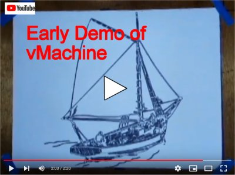
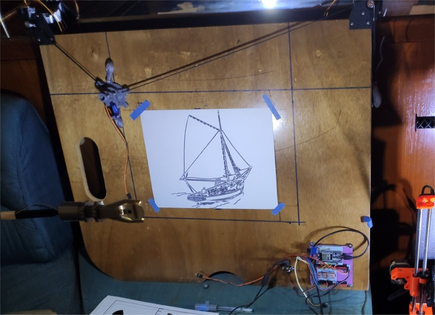
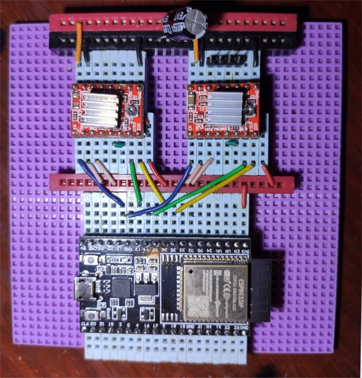
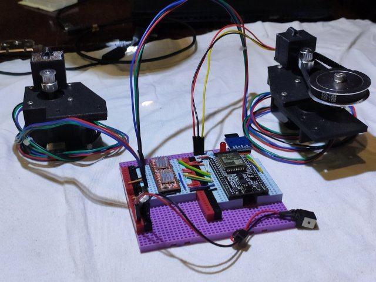
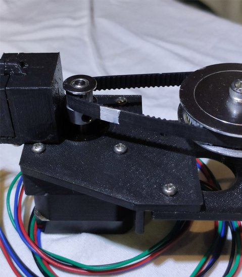
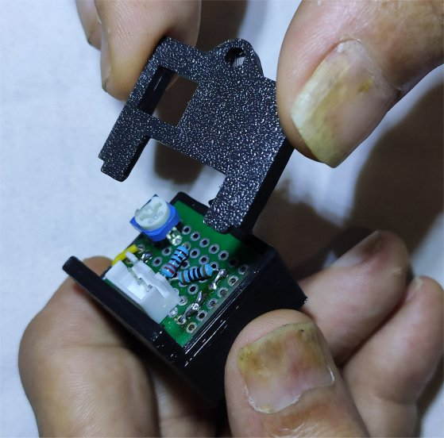
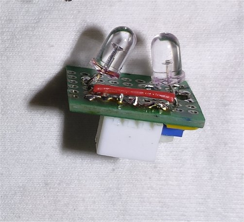
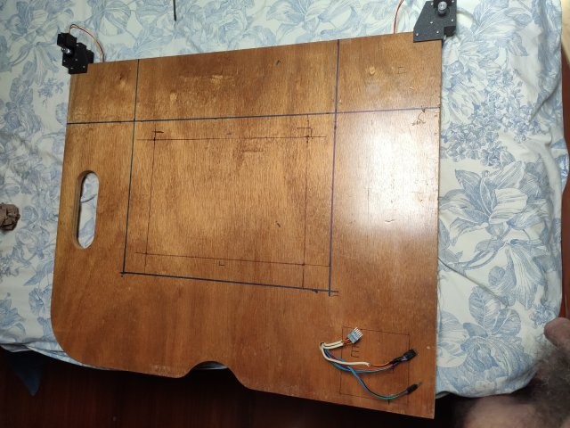
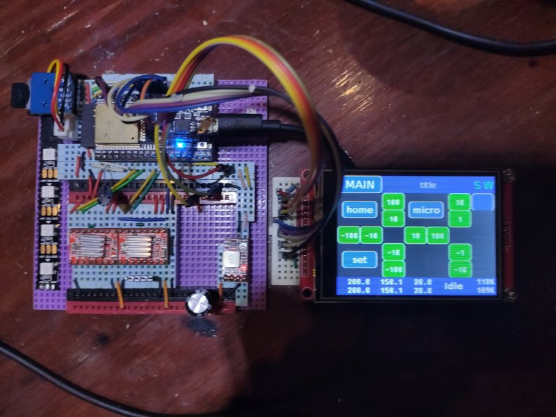

# The vMachine - History

**[Home](readme.md)** --
**History** --
**[Hardware](hardware.md)** --
**[Electronics](electronics.md)** --
**[Software](software.md)** --
**[Installation](installation.md)**

After deciding that I would use an ESP32 for the machine, a search for available software
revealed that the best alternative for me was the **Grbl_Esp32** codebase (which has
since been advanced and renamed to **FluidNC**).   So a large chunk of work (several months)
was spent in learning **Grbl_Esp32** and porting the **Maslow** triangular kinematics software
to it.

At some point I got
it working well enough to build a machine and draw a picture.

Here is a timelapse video of the early vMachine printing a picture of a sailboat:

The version of the vMachine (that drew the above image) used a bread-boarded circuit (not soldered)
and looked like this:

I like to use these [5E Board](https://www.5eboard.com/product/5eboard-high-qaulity-reconfigurable-solderless-breadboard-4x4-advanced-kit-violet-blue/)
breadboards, but you can create the basic circuit on a regular breadboard too.   The basic circuit is pretty
simple, just an **ESP32** dev board and two **A498** stepper motor drivers (with a single shared
**100uf capacitor** on the high voltage bus).   Each driver gets one pin (**green**)
from the ESP to the *STEP* input of the a498 and another pin (**yellow**) to the *DIRECTION* input.
The **blue** wire is connected from a pin on the ESP to the *ENABLE* pin on both A498's.
Otherwise, the **pink** wires connect two of the a498 step resolution selection pins to *3.3V* to
select 1/8 micro-stepping, the **red** wire provides *VCC* (3.3V) to the a498
(running underneath the board), **black** is ground (not yet hooked up to the ESP32 in this image),
and the **orange** wire (and bus at the top) is for the 19.5V I used to power the stepper motors.

The stepper motors plug into the breadboard via a 4 pin header as in the upper right
of the above phote.  You can click on the image for an enlarged version.

The ESP32, as well as the code, are fairly flexible about pin assigmnents, and you can see
from the photo the pins I used in this early version.  The pinouts of the "final" vMachine
are a bit different and can be found on the **[Electronics](electronics.md)** page
and within the **source code** itself.

This photo is intended to merely show that the circuit is relatively simple,
and can be produced on a breadboard.  There is no SDCard or display wiring on this board,
but it could actually be used in a functional vMachine by plugging the RC Servo directly
into ground, 5V, and some other pin on the breadboard.

I used an old 19.5V 35W power supply from a broken computer i had laying around.  I removed
the jack from the broken computer and wired it up with dupont connectors for this initial
iteration of the machine.

## Infrared Belt Sensors

An important part of this project, that took quite a bit of time coming up with, was how to
effect homing switches on the machine.  In order for the triangular kinematics to
work, and in general, it is necessary that the machine **"know where it is"**.   So, before
I even built an actual machine, I decided that I would use an **infrared sensor** and a **white
stripe** painted on the belt to sense when the machine was in the *home* position.

Below is a photo of the **sensor test rig**.  I had already 3D printed the stepper motor mounts,
and tested the stepper motor's basic functionality and my ability to control them from software,
but I needed to test the sensors with a belt with a white stripe on it, so I added a pulley and
circular belt to one of the motor mounts (on the right). The pulley and belt are not part of the
actual vMachine; they were only used in this test rig. The below photo also includes housed and
mounted versions of some early infrared sensors.

Once I had the pulley on, I painted a white stripe on the belt with some acrylic paint:

And was able to test and develop the infrared sensors and 3D printed housing.

The rudimentary infrared sensor board has been improved in the current design, but
here's a picture of the old one for posterities sake.  It emits infrared light from
one LED and measures it with the other through a small slot at the bottom of the housing,
so that it can sense when the white stripe passes over the motor pulley:

## A Board of Some Sort

I looked around the boat for a **board** to mount the motors on, and, lol, the best board
I found was the *support for my bed*!   So I pulled the board out from under my bed, drilled
a few holes in it, and mounted the motors and breadboard on it so that I could try it:

## Development of Touch UI. Moving On, and Coming Back

So after a month or two of messing around with the software, electronics, and 3D printing
I finally came up with the machine above, and was able to get it basically working and
produce the timelapse video of it drawing a sailboat.

I wanted to document it at that point as a "project", but I was still very deeply involved
in the development and it felt like it was not complete.

For example, I decided I wanted to add a **touch screen user interface** which itself turned
into a fairly long-term project.  I worked on the TFT UI for at least a month or two with just
the breadboarded circuit on my desk and not installed on the "machine".

I also added a **WS2812b led strip** to the circuit to allow me to display an arbitrary
number of individually addressable colored LEDs using just one pin from the ESP32.  In
the above image there is a strip of four LEDs, but in the final machine I cut it down
to three ... one for each infrared sensor that turns red when the sensor is triggered,
and one for the overall system state (blue=idle, yellow=busy, flashing red=error, etc).

The point is that one thing led to another and before I was ready to start THIS documentation
effort, I had alresdy moved on to, and ended up completing another whole "machine" ... the
[cnc3018](https://github.com/phorton1/arduino-cnc3018) machine.  As part of THAT process
I learned how to **mill my own PCB boards** and so, when it came time to return to
the vMachine to write this documentation, I essentially decided to rebuild it from
scratch using a home made PCB.

Sigh/LOL.

So I did that and these pages now describe the second, and perhaps final version of the
vMachine, and not, per-se, the machine pictured above.  Nonetheless, I wanted to preserve
some of the photos and history of my early development work on the vMachine, and so, hence,
this page.

Please continue reading to see details on how to build a physical vMachine,
install and build it's software, how to use it, and how it fits into the bigger
scheme of things ...

 

<a href='hardware.md'>NEXT</a><i> - the vMachine Hardware ...</i>

