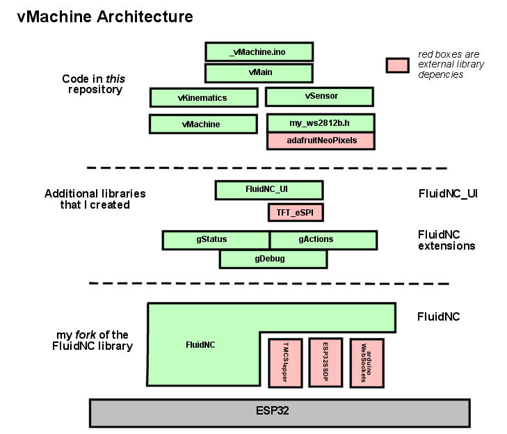

# The vMachine - Software

**[Home](readme.md)** --
**[History](history.md)** --
**[Hardware](hardware.md)** --
**[Electronics](electronics.md)** --
**Software** --
**[Installation](installation.md)**

The above diagram gives a birds-eye view of the architecture of the
vMachine software.

At the top, the *code in this repository* includes
the main *Arduino Sketch* **_vMachine.ino** file which
implements the usual Arduino *setup()* and *loop()* methods.

Below that the **vMain** layer/component *(cpp file)* contains the
**glue** (mostly overridden *weakly bound* methods) to **FluidNC**.
Most of the vMachine specific functionality is implemented in this
component.  It initializes and makes use of the **vKinematics** and
**vSensor** classes and knows about the **vMachine** *(configuration
settings*) so that it can implement things like the *triangular
coordinate* system transformations and the *homing* algorithm.

The **vMachine class** itself *(cpp and h files)* mostly contains
the *configuration settings* that are specific to this
*FluidNC based CNC machine*, but almost no other functionality.
The vMachine specific settings (like the machine width and height,
the distance between the motors, etc)
are visible to, and used by the components above it as needed.

There is also a small optional compnenent, the **ws2812b.h** file which
presents a thin wrapper around, and a few color constants for use
with, the **adafruitNeoPixels** library if the LEDS are inluded
in the build.

Below the *dotted line* in the digram are the other libraries and
code used by the vMachine.

In my architectural diagrams **visibility**
is connoted vertically in **layers**, and within layers there are
**components**. Typcially, but not always, *components* are synonymous
with C++ *classes*.
Things higher in the diagram *can see* (know about) the components and
layers below them, but things in lower layers cannot see (do not know about)
things above them.  Components at the same level in the diagrams have *varying
degrees* of visibility of one another, depending on the detailed design.

The vMachine makes use of my
[**FluidNC_extensions**](https://github.com/phorton1/Arduino-libraries-FluidNC_extensions)
library and my
[**FluidNC_UI**](https://github.com/phorton1/Arduino-libraries-FluidNC_UI)
library.  The FluidNC_UI library is in turn, dependent on the
[**TFT_eSPI**](https://github.com/phorton1/Arduino-libraries-TFT_eSPI)
library which is shown in **red**.
Within the FluidNC_extensions library there are a number
of components including the **gStatus**, **gActions**, and **gDebug**
objects and methods.

Below the seecond *dotted line* is
[**my fork**](https://github.com/phorton1/Arduino-libraries-FluidNC)
of the **FluidNC** project
repository.  The bulk of the actual functionality of the vMachine is
provided by this library.  It in turn depends on the **TMCStepper**,
**ESP32SSDP**, and **arduinoWebSockets** libraries.

And finally, at the bottom of the diagram is the **ESP32** hardware,
abstracted into a single box.

 

## vMachine.ino

**vMachine.ino**, as expected, contains the usual Arduino **setup()**
and **loop()** methods.

They more or less simply call the corresponding
**main_init()** and **run_once()** methods from *FluidNC*.

There is a little bit of additional code in vMachine.ino to
optionally *initialize the SD Card*.  I found that initializing
the SD Card the very first thing in the program tends to be
the best, as the SDCard does not play well with other *SPI*
devices until it has been properly initialized.

 

## vMain.cpp

**vMain.cpp** contains the *glue* to FluidNC which takes the form
of a number of overriden *weakly bound* methods, including:

- **display_init()** - called early from FluidNC during the call to *main_init()*
- **machine_init()** - called from FluidNC during the call to *main_init()*
- **cartesian_to_motors()** - called from FluidNC with cartesian coordinates,
converts them to triangular coordinates (belt lengths) and *"renders"* the line
by calling the FluidNC **mc_line()** method.
- **motors_to_cartesian()** - called from FluidNC when it wants to report the
*machine position* in cartesian coordinates based on the current *belt lengths*.
- **user_defined_homing()** - implements the vMachine specific *homing* method
- **user_realtime_command()** - allows for extension of the FluidNC *realtime
command* set, some of which are passed to the *FluidNC_UI* if it is included
in the build.

.. as well as the code, methods, and variables to support those methods.

 

## vMachine.h and cpp

Contains the **vMachine class** which is derived from FluidNC's
**MachineConfig** class.  It works within the FluidNC *YAML*
configuration scheme to provide vMachine specific configuration
settings and accessors to them for things like the machine
width and height, distance between motors, and so on, that
are used in the implementation of the kinematics, homing, etc.

The specific settings, and their default values are shown below.

- **$machine_width**            = 400 mm
- **$machine_height** 		    = 300 mm
- **$dist_between_motors**	    = 730.25 mm
- **$motor_offset_y**		    = 125.9 mm
- **$sprocket_radius**          = 4.8 mm
- **$chain_tolerance_left**     = 0
- **$right_tolerance_right**    = 0
- **$sag_correction**           = 0
- **$sled_radius**              = 0 mm
- **$guess_tolerance** 		    = 0.05 mm
- **$guess_num_max**     		= 200
- **$guess_max_chain_length**   = 1000
- **$zero_length**              = 209.849 mm
- **$zero_offset_left**         = -10.0 mm
- **$zero_offset_right**        = -10.0 mm
- **$safe_area_offset**         = 5.0 mm
- **$safe_position_z**     	    = -70 degrees
- **$line_segment_length**      = 0.5 mm

Please see **vMachine.cpp** and the implementation files for
descriptions of these settings and how they are used.

 

## vKinematics.h and cpp

Contains my port of the
[Maslow triangular kinematics](https://github.com/MaslowCNC/Firmware/blob/master/cnc_ctrl_v1/Kinematics.cpp).

 

## vSensor.h and vSensor.cpp

Contain an implemention of *infrared sensors* using
**analogRead**.  Note that this file *may* have been
obviated in the latest design revision of the sensors,
which now *may* work using **digitalRead()** directly
from within FluidNC.

 

## Please Also See

Please also see the other libraries and reposistories referenced on this page.

 

<a href='installation.md'>NEXT</a><i> - Installing and building the firmware ...</i>

